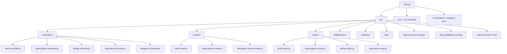

# NSG Backend - Project Structure & Architecture

This document provides a comprehensive overview of the **NSG-Backend** project structure, designed to help an AI agent or developer understand the codebase quickly.

## 🏗 Architecture Overview

The project follows a standard **Node.js/Express** architecture using the **Controller-Route-Model** pattern. It uses **MongoDB** as the primary database with **Mongoose** for object modeling.

### 🛠 Tech Stack

- **Language**: JavaScript (ES6 Modules)
- **Framework**: Express.js
- **Database**: MongoDB (Mongoose)
- **Authentication**: JWT (JSON Web Tokens)
- **External Integrations**: Google Calendar, Telegram Bot, Fathom Video.

---

## 🧬 Folder Structure

---

## 📂 Directory Breakdown

### 📍 `src/`

The core of the application logic.

- **`index.js`**: Entry point that starts the server.
- **`app.js`**: Configures Express, middleware, and registers routes.
- **`db.js`**: Handles the connection to MongoDB.
- **`config.js`**: Environment variable configurations.

### 🕹 `src/controllers/`

Contains the business logic for each resource.

- `auth.controller.js`: User registration, login, and profile.
- `transcription.controller.js`: Logic for audio/text transcriptions and analysis.
- `telegram.controller.js`: Integration with Telegram IDs and users.
- `fathom.controller.js`: Processing Fathom meetings/transcripts.
- `google.controller.js`: Google Calendar OAuth and event syncing.
- `billing.controller.js`: Stripe integration, checkout sessions, and subscription status.
- `billing.webhook.js`: Handles real-time Stripe events.
- `education.controller.js`: Management of the knowledge vault and document processing.

### 🛣 `src/routes/`

Defines the API endpoints and maps them to controllers.

-   Routes are organized by module (e.g., `/api/auth`, `/api/transcriptions`).

### 🗄 `src/models/`

Mongoose schemas defining the data structure in MongoDB.

- `user.model.js`: User profiles and authentication data.
- `transcription.model.js`: Stores transcript content and metadata.
- `telegram_user.model.js`: Links Telegram IDs with platform users.
- `fathom.model.js`: Stores Fathom-related integration data.

### 🛡 `src/middlewares/`

Custom Express middlewares.

- `validate_token.js`: JWT verification and role-based access control.
- `validator.middleware.js`: Schema validation for incoming requests.

### 📋 `src/schemas/`

Zod or similar schemas for request body validation (ensuring data integrity before reaching controllers).

---

## 🚀 Key Features to Note

1. **Stripe Billing System**: Full subscription loop from checkout to webhook synchronization.
2. **Knowledge Vault (Education)**: Intelligent document processing with large-file optimization.
3. **Multi-Platform Integration**: Hub for Telegram, Google Calendar, and Fathom.
4. **Production Ready**: Optimized Docker support for KVM/VPS deployment.
5. **Transcription Hub**: Handles complex transcription data, linking it to various analyses (`transcription_analysis`).
6. **Fathom Pipeline**: Specific logic to handle meeting transcripts from Fathom.
7. **Validation Layer**: Uses specific schemas to validate every incoming request.
